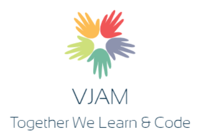

# VJAM

## Background
The intent of starting this VJAM is as follow 
- To involve all those developers who don't have local community but want to learn
- To involve all those developers who can not attend an actual CodeJAM
- To learn from each other what they know, its very difficult to learn everything but in VJAM the experts in that subject can help us learn

## Duration of the Virtual JAM
- Everyone is busy with his/her work so keeping in mind a VJAM duration can vary from 1 hour to 2 hours max.

## How we will execute it?
- 45-50% of the time will be for the presenter and rest for the participants.
- Presenter will divide his/her sessions logically so as to make sure all participants can do whatever is show cased.
- Participant will have some pre-requiste before the session which will help them in finish the VJAM on/before time.

## Who can Participate?
- Anyone to everyone only thing needed is a willingness to learn.

## Who can Present
- Anyone to everyone only things needed is a willingness to share

## What all do we need?
- You need a laptop/deskotop 
- The access to different system varies from topic to topic. Every event will have a pre-requiste which needs to be done before joining the session

## VJAM Event Calendar
- We are going start with our first VJAM in month of Oct 2019 with topic as [Fiori Elements](https://github.com/NabheetCloud/VirtualJAM/tree/master/Fiori%20Elements).

## How can we participate?
- Please reach out to me on [SAP Community](), [Twitter](https://twitter.com/nabheet), [LinkedIn](https://www.linkedin.com/in/nabheet-madan-80594821/), telegram id ***@nabheetmadan*** or [email me](nabheet.jobs@gmail.com)
